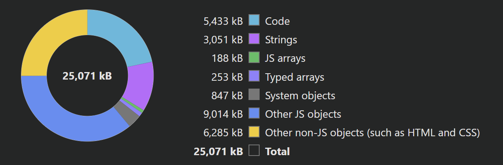

# Personal
Hi, This is my personal page, It is hosted in Github Webpages.

I aim to develop a website that meets my standards while overcoming the limitations of a static server.

# Future Improvements
## Increase abstraction
Implement more Mentos objects to reduce headstart time at adding information to the webpage
## Improve Performance
The current memory use of the page is the following:

As you can see, or hear, the majority of the used memory in my page belongs to objects. Although this is expected, there seems to be room to improve performace by only implementing the functionalities of the modelViewer library I will use since a great part of it is focused in AR functionalities I am not going to use.